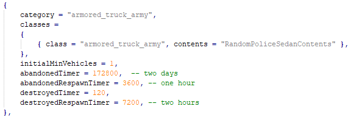
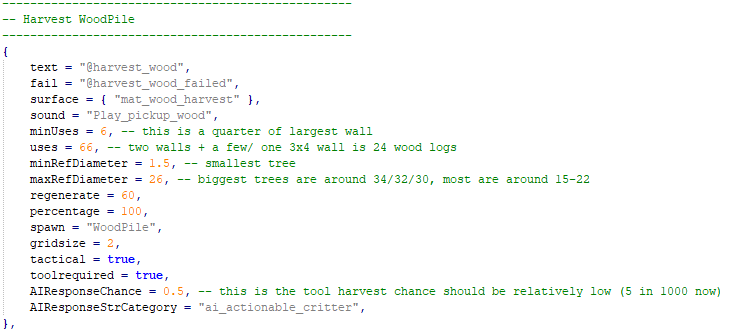
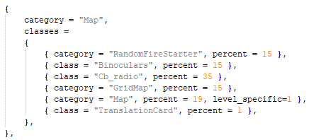
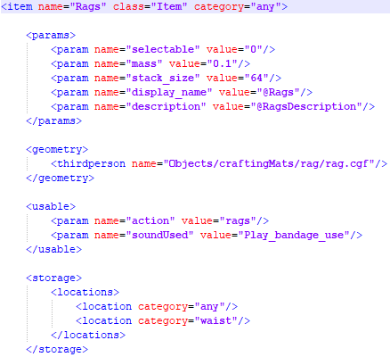

## MisModding-101
A Miscreated Modding guide for beginners.
*Created by the Miscreated Modding community and put together by 4iY*

Consider joining the **UnOfficial MisModding Discord** server by this link: https://discord.gg/ttdzgzp . It is the best place to ask modding-related questions and request assistance on similar matters. Please take a look at this guide before asking questions, particularly if you are running into issues uploading / packing files.

## Introduction 
So, you’ve seen all these fancy mods on the Steam Workshop and want to do the same (or at least come close to them)? You have come to the very right place then – this guide will teach you in detail how to create mods. It’s divided into sections for your convenience.

## Sections
- Initial set-up
- Modding flow, uploading to Steam + Examples
- Extras (manual mod upload, reference links)

## Initial Set-up
Making mods takes some initial set-up steps to be done. I recommend creating an empty folder somewhere (preferably on a drive that has a bit of free space) where the modding files will be put in. Now let’s dive straight into it.

1.) Download the files to upload the mod (we’ll do that part a bit later, after we actually create the modification) from this video’s description (official link provided by the developers): https://www.youtube.com/watch?v=Ucqr21oA0WY

2.) Download Theros’s MisModPacker under this link: https://github.com/4iY/MisModPacker  and save it in a separate folder (it will be used a lot)

3.1) Install SteamCMD from this official link (put it in a separate folder but remember where it is): https://steamcdn-a.akamaihd.net/client/installer/steamcmd.zip

3.2) Alternatively, you can use a 3rd-party tool created by Theros to upload mods - all instructions for its usage and the link to download it is in here: https://github.com/MisModding/MisModPublisher . It should be noted that this tool is the *recommended* way of uploading mods as it has more features - you should give it a try *before* the SteamCMD method. That said, this guide is not the place to look for instructions on its usage - take that to the GitHub project linked just above.

4) It is also recommended to install Notepad++ for editing LUA and XML files for modding (https://notepad-plus-plus.org/downloads/ ) and an archiving software. There is one personally recommended by experienced modders – PeaZip (https://www.peazip.org/), but you can use the likes of WinRar or 7zip if you want to assuming they do not cause issues with your system.

### WARNING!
**Never edit any file directly** – instead, copy it somewhere separate from the game, such as your Desktop, and make all changes there. Directly editing files, especially inside the game’s GameSDK folder, is a sure way to data corruption.

## Examples and Modding Flow
The easiest part of modding is what I call re-scripting, such as changing spawn values or percentages, yet is still takes some expertise to do correctly. Let’s take a look at a few examples. 

### VehicleSpawnerManager.lua

**VehicleSpawnerManager.lua** (short:VSM) is the file responsible for anything related to vehicles.

Its structure is fairly intuitive:
You have the *category*, which is the type of spawner in question.
Then the class(es) which define which class(es) of vehicles will actually spawn on that category of spawnpoints.
There are parameters of the category. Lets take a closer look at them:

**initialMinVehicles = 1,** is the line that adjusts the amount of vehicles that can be maximally on the map at any given time (*if some are destroyed the game will spawn them so its at the limit*) 

**abandonedTimer = 172800,** is the line that adjusts how much time a car can stay without interaction, upon this value exceeding the vehicle will be removed from the map. 

**AbandonedRespawnTimer = 3600,** is the timer for the vehicles respawn after it has disappeared for being abandoned 

**destroyedTimer = 120,** is how long the remains stay after explosion 

**destroyedRespawnTimer = 7200,** is the timer of how much time it will take to respawn after being destoyed . It should be noted that this timer is not precise - instead, it is randomized with unadvertised limits. Changing this value will shift the limits too, but do not expect it to spawn exactly after X amount of time has passed. 

### ActionableWorldManager.lua

**ActionableWorldManager.lua** (short: AWM) is the file responsible for anything that has to do with items that players directly interact with, be it gathering wood by hitting a tree or drinking water from a watersource. Let's take a closer look at Harvesting WoodPile: 

Not all of these strings are useful to modders. The main ones you may want to adjust are  

**uses = 66,** which defines how many pieces of resource can be gathered from one gathering point and **percentage = 100,** which defines the amount of resource gathered per one interaction. As such, if you put it to 50 the player will only receive one piece per two hits; if it is put to 200 the player will receive 2 pieces of resource per one hit. 

### ItemSpawnManager.lua

**ItemSpawnManager.lua** (short: ISM) is the most complex and largest file out of all the spawners, and for a reason: this file is solely responsible for ALL item spawns, either out in the open or within context items (lootable by utilizing the mouse wheel). It is also the file that maintain's traders' inventories. 
Let's take a look at the very first category that is used inside the game: Map 

As you can see, the structure here is similar to VSM: it has a *category*, which defines the spawnpoint type (name), and *class*(es), which define which items will actually spawn there. The difference here is that these items have percentages and some other parameters, such as min/max numbers or a `level_specific=X` switch.
Percentage is pretty self-explanatory, but there is a warning I should give: ***Inside a category all classes' percentages MUST equal 100 - otherwise the whole category will NOT work.***. Furthermore, `min/max` values define the minimum and the maximum number of items within a spawned stack and `level_speicic=X` switch is explained at the top of the file in a comment. 

### Editing XML files

**.XML files** are the files which dictate *all* properties of items, vehicles, baseparts and so on. Any new item would need one, and that said you are free to modify any existing one too to suit your needs - such as extending stack size on a stackable item or say increasing its weight. Let's take a look at the structure of an XML file for Rags (located in Scripts/Entities/Items/XML/Equipment)

The main category we want to look at here is `<params>` - this is the block of code which sets, well, parameters.

`<param name="mass" value="0.1">` is the item's mass (in KGs); `"stack_size"` is stacksize, or how many items can be stacked with each other (Tip: it is wise to not make items that have health stackable *(these are the items that have a `"health"` parameter)* as that will cause UI glitches). 

Next category we should check is `<usable>`, and this one defines which action(s) is attached to the item in question as well as what sound plays when said action is used. Pretty straight-forward.

Lastly, let's take a look at `<storage>` - this defines where the item can be stored. `"any"` means anywhere (apart from usable slots, such as 1-4 or 5-6), and in this example `"waist"` means that Rags can be stored on your waist instead of a Fanny Pack. **Warning: you cannot specify more than 2 storage locations!**

### Advanced modding techniques

As you may have noticed, there are two additional folders inside the Spawners one: ism_mods and vsm_mods. They each have a *sample* file inside of them, stating how to add new items without modding the whole ISM (*such an action can lead to issues when a new update comes out*). Using this technique you will be able to override certain parts of ISM and VSM spawner files which would significantly lower the chance of any problems arising later on. *Take a look at these files, they have everything explained well inside of them.* If you cannot figure out a part of its usage or have any modding-related question, you should join the UnOfficial Modding Discord server by the link at the top of this guide. 

### Conclusion on re-scripting

The text above is merely an example so you start to understand the inner workings of different files in Miscreated. Of course, it is best to experiment yourself - that is the most fun and also the best way of becoming good at modding. If you have any qustions it is a good idea to ask inside the *UnOfficial Modding Discord*, joinable by the link at the top of this guide.

## Making & Uploading a mod
Every mod for Miscreated is in the form of a .pak archive. So how exactly does one create it?
It is trivial – all you have to do is put all files inside the correct folders (you may need to create them – see **warning** below) in the Workspace folder of MisModPacker (which we downloaded previously) and then run CreatePak.bat. You new .pak file will be located in Build called workshop_build.pak - you should rename it before uploading.

### WARNING!
There is one very important part here, ***you must retain the folder structure leading to whatever files you want to upload in full.*** Meaning you cannot just upload the few .lua files we adjusted inside a .pak as is. The inner structure of the .pak file has to copy that of the GameSDK and original .pak files: as an example, for the VehicleSpawnerManager.lua file you would need to mimic the folders leading to it, starting with the GameSDK folder. The structure of a .pak would look like this: `MyMod.pak\GameSDK\Scripts\Spawners\VehicleSpawnerManager.lua`

### Uploading a mod
After we created the .pak file all that’s left is to upload it, and that is done via the mod_create.bat file. Before we proceed, open the mod.vdf file and edit the Path (*it has to be leading to the .pak file of the created mod*), Title and Description, last two being recommended but entirely optional. 
Now Right-click on the mod_create.bat file and press Edit (you can use any text editor for that). Adjust, if necessary, the path to your SteamCMD installation. Then, replace the login and password words with those of your Steam account.
### NOTICE!
You cannot upload mods from an account that is currently in use, like someone logged in on it. *If you do not have another Steam account kill the process called Steam Client Bootstrapper in Task Manager.* **If your login has a dot or a special symbol then this will not work, there will be an explanation further down how to manually upload mods**) – ***make sure to remove the less than / more than (< and >) symbols but retain all spaces.*** Next, adjust the path to mod.vdf so it leads to where it actually is located. Then save the file and double-click on it to run the .bat. 
Upon doing so a SteamCMD window will pop up – it may ask you to fill in the Steam Guard code, please do so if it does – and the process of uploading the mod should start. If it doesn’t, double-check all paths inside both mod.vdf and your mod_create.bat file. If you cannot figure out what’s going wrong, please jump to Extras for a guide on how to manually use SteamCMD to upload mods.
You will find the ID of your freshly created mod under PublishedFileID inside the mod.vdf file – that is the exact ID which is put in a server’s mod list.
### NOTICE 2!
__Your mod MUST be set to either Public or Unlisted in its privacy settings, it WILL NOT work otherwise!__

## Extras
### Manual use of SteamCMD to upload mods (if having issues using .bat file)
1) Open SteamCMD.exe directly from its installation

2) Type in **`login USER PASSWORD`** , replacing the last two words with your Steam login credentials and press Enter (enter your Steam Guard code if prompted to)

3) Type **`workshop_build_item THEPATH`** , replacing **THEPATH** with the full path to the mod.vdf file (that’s the same path as you would input into the mod_create.bat file). The uploading process will now start. You can grab the ID of your fresh mod either from the SteamCMD window itself or from the mod.vdf file assuming you cleared the previous ID from there (if it was not there then dont worry).

### Videos for reference by Entrada Interactive 
https://www.youtube.com/watch?v=Ucqr21oA0WY&list=PLMCbP34P4_GO8fLHePTyWkcuODH4eglEC  - Lunchbox mod, includes visual editing of files and uploading via SteamCMD

